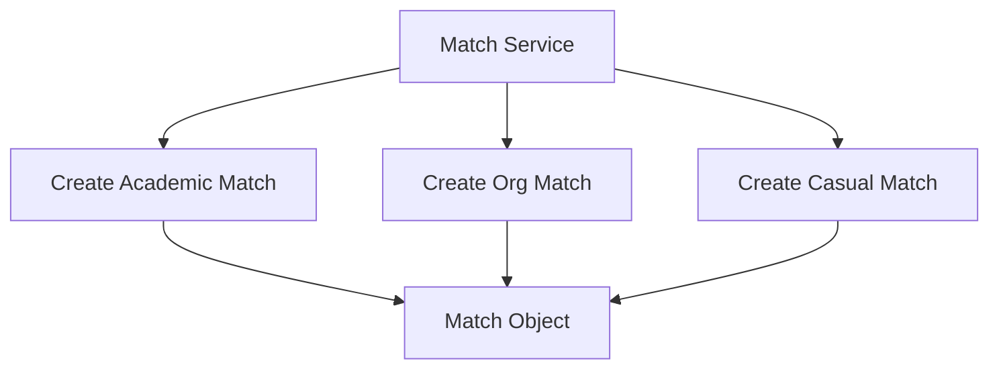
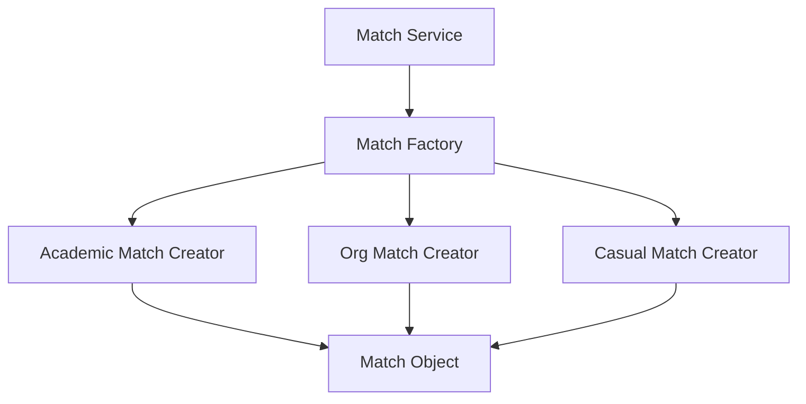
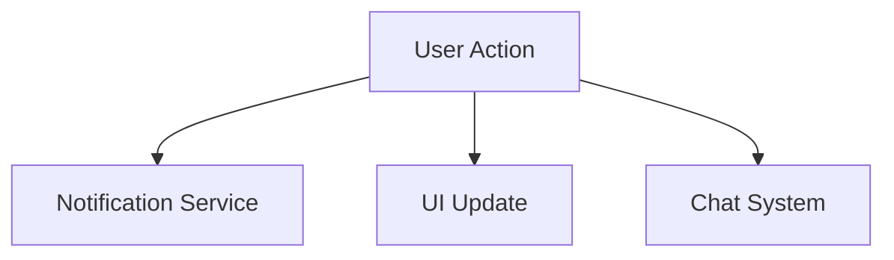
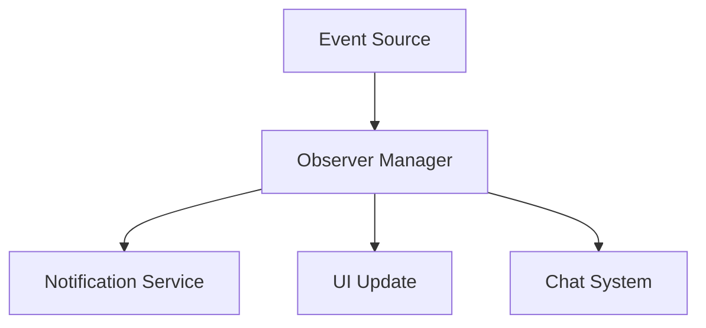
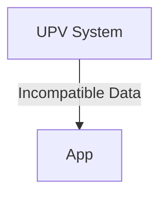
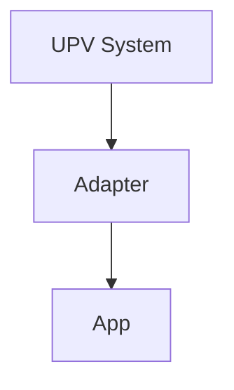

# CMSC129_Activity2_DesignPatterns
# UPV Dating App – README

## a. App Summary

The UPV Dating App is a university-exclusive dating platform designed specifically for students of the University of the Philippines Visayas (UPV). Unlike typical dating apps, this one integrates campus culture, shared academic experiences, and student life into the matchmaking process.

### Core Idea

Instead of purely appearance-based swiping, the app matches users based on:

* Degree program compatibility
* Class schedules
* Organization affiliations
* Study habits and campus hangout preferences

### Unique Twist

The app introduces a feature called **"Academic Chemistry"**, where matches are influenced by how compatible students are in terms of study style, productivity patterns, and even preferred campus spots. It also includes:

* **Study Date Mode** – suggests matches who are available at the same time for studying
* **Org-Based Matching** – connect with people in the same or related organizations
* **Anonymous Crush Reveal** – users can secretly like someone and only get revealed if mutual

---

## b. Design Pattern Implementation

### 1. Name of Pattern

**Creational – Factory Pattern**

---

### 2. Concept in Conyo

So basically, the Factory Pattern is like… instead of you directly creating objects everywhere (which is super kalat and hard to maintain), you centralize object creation into one "factory".

Parang, instead of doing:

> "I’ll create this Match object here, and another one there, and another one somewhere else..."

You go like:

> "Factory, ikaw na bahala gumawa ng Match depending sa situation."

#### When it's used

* When madaming types of objects (e.g., different match types)
* When object creation is complex
* When you want flexible and scalable code

#### Applied Feature in Dating App

Used in the **Match Generation System**, where different types of matches are created:

* Academic Match
* Org Match
* Casual Match

---

### 3. Visual Diagram

#### ❌ Without Factory Pattern



#### ✅ With Factory Pattern



---

### 4. Why it Works Nga

#### Without Factory Pattern

Grabe, everything is hardcoded. Every time you need a new match type:

* You modify existing code (risk of bugs)
* Violates Open/Closed Principle
* Code becomes messy and tightly coupled

Parang spaghetti code na siya over time.

#### With Factory Pattern

Mas clean siya because:

* Centralized creation logic
* Easy to add new match types without breaking existing code
* Loose coupling between services and object creation

Basically, scalable siya and hindi ka mahihirapan mag-expand ng features later.

---

### 5. Pseudocode

```plaintext
// Step 1: Create Match Interface
interface Match {
    function generateProfile()
}

// Step 2: Concrete Match Types
class AcademicMatch implements Match {
    function generateProfile() {
        return "Match based on study habits"
    }
}

class OrgMatch implements Match {
    function generateProfile() {
        return "Match based on organizations"
    }
}

class CasualMatch implements Match {
    function generateProfile() {
        return "Random casual match"
    }
}

// Step 3: Factory Class
class MatchFactory {
    function createMatch(type) {
        if (type == "academic") return new AcademicMatch()
        if (type == "org") return new OrgMatch()
        if (type == "casual") return new CasualMatch()
    }
}

// Step 4: Usage
factory = new MatchFactory()
match = factory.createMatch("academic")
match.generateProfile()
```

---

## 2. Behavioral Pattern – Observer Pattern

### 1. Name of Pattern

**Behavioral – Observer Pattern**

---

### 2. Concept in Conyo

So like, instead of checking manually kung may bagong ganap (like new match or message), the system is like:

> “Uy, naka-subscribe ka? Sige, i-uupdate kita automatically.”

Parang follow system siya. If may event (like may nag-like sayo), all subscribers (notifications, UI, chat) get updated agad.

#### When it's used

* Real-time systems
* Event-driven features
* When maraming components need updates from one action

#### Applied Feature in Dating App

**Real-time Notifications System**:

* New Like
* New Match
* New Message

---

### 3. Visual Diagram

#### ❌ Without Observer Pattern



#### ✅ With Observer Pattern



---

### 4. Why it Works Nga

#### Without Observer

* Tight coupling (everything directly connected)
* Hard to scale
* Every new feature needs modification sa core logic

#### With Observer

* Loose coupling
* Plug-and-play observers (easy to add/remove)
* Mas scalable for real-time systems

---

### 5. Pseudocode

```plaintext
// Observer Interface
interface Observer {
    function update(event)
}

// Subject
class EventManager {
    observers = []

    function subscribe(observer) {
        observers.add(observer)
    }

    function notify(event) {
        for each observer in observers {
            observer.update(event)
        }
    }
}

// Concrete Observers
class NotificationService implements Observer {
    function update(event) {
        displayNotification(event)
    }
}

class UIService implements Observer {
    function update(event) {
        refreshUI(event)
    }
}

// Usage
eventManager = new EventManager()
eventManager.subscribe(new NotificationService())
eventManager.subscribe(new UIService())

eventManager.notify("New Match")
```

---

## 3. Structural Pattern – Adapter Pattern

### 1. Name of Pattern

**Structural – Adapter Pattern**

---

### 2. Concept in Conyo

So parang may dalawang systems na hindi magkaintindihan.

Example:

* UPV system: “student_id”
* App mo: “userId”

Instead of changing everything, gagawa ka ng **adapter** na taga-translate.

> “Ako na bahala mag-adjust between you two.”

#### When it's used

* Integrating external systems
* Different data formats/interfaces
* Legacy systems

#### Applied Feature in Dating App

**UPV Student Verification + Profile Sync**

---

### 3. Visual Diagram

#### ❌ Without Adapter Pattern



#### ✅ With Adapter Pattern



---

### 4. Why it Works Nga

#### Without Adapter

* Incompatible systems
* Need to rewrite existing code
* Error-prone integration

#### With Adapter

* Clean separation
* No need to modify existing systems
* Easier maintenance and scalability

---

### 5. Pseudocode

```plaintext
// Existing UPV System
class UPVSystem {
    function getStudentData() {
        return { student_id: "2023-12345", course_code: "BSCS" }
    }
}

// Target Interface
interface UserProfile {
    function getUserId()
    function getProgram()
}

// Adapter
class UPVAdapter implements UserProfile {
    upvSystem

    constructor(upvSystem) {
        this.upvSystem = upvSystem
    }

    function getUserId() {
        data = upvSystem.getStudentData()
        return data.student_id
    }

    function getProgram() {
        data = upvSystem.getStudentData()
        return data.course_code
    }
}

// Usage
upv = new UPVSystem()
adapter = new UPVAdapter(upv)

userId = adapter.getUserId()
program = adapter.getProgram()
```

---

## Final Summary

| Category   | Pattern  | Feature Used                      | Purpose                    |
| ---------- | -------- | --------------------------------- | -------------------------- |
| Creational | Factory  | Match Generation                  | Flexible object creation   |
| Behavioral | Observer | Notifications & Real-time Updates | Event-driven communication |
| Structural | Adapter  | External Data Integration         | Interface compatibility    |
